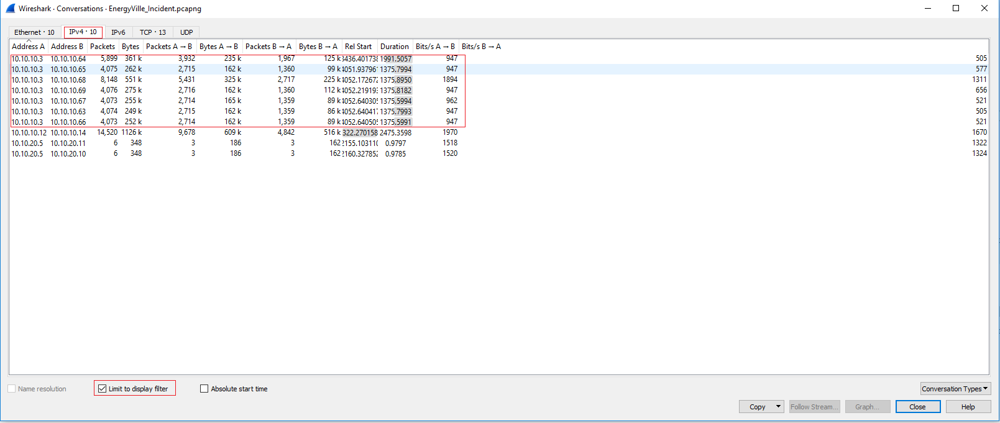
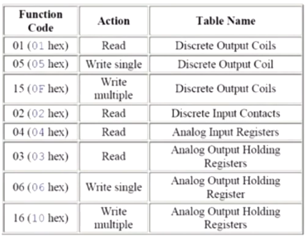

NOtes:
10.10.10.11 -> 10.10.10.3: workgroup\myuserisafl4g
10.10.30.129 -> 10.10.30.130: SMB file: SecretFile.txt: Dragos_C0ll3cting_S3cr3ts
103.82.4.84 file upload DIGIBot.py (cobolt strike)
10.10.10.11: nothingtoseehere.cmd
	post exploitation
	ADRecon-master
	.... -> http objects
	destination 10.10.10.3
	
	
	
# Answers:
## Question 1: Initial foothold
We believe that one of the initial footholds for the Adversary was the HMI in the Battery Network.
		
***How do we find these answers?***
		
> A lot of these types of devices work on the MODBUS/TCP portocol (TCP/502).
> Now that we know this we can look in the wireshark capture and use this as display filter: `tcp.port == 502`. Using the conversation view (`statistics > conversations > IPv4 > Limit to display filter`) we can find all the conversations that use MODBUS/TCP (HMI & PLC devices).

		
- What is the IP address of the HMI?
	- `statistics > Endpoints > IPv4 > Limit to display filter` the one with the most packets + corolating with the conversations gives us:
	- `10.10.10.3`
- What is the Manufacturer of the HMI (e.g. Siemens)?
	- `Schneider Electric`
- How many industrial devices does this HMI monitor?
	- `7`
- While the HMI should have only been monitoring the battery network, we've noticed some suspect industrial traffic. Can you investigate and determine what devices were targeted?
	- Input the IP address(es), separated with ";".
	- `10.10.10.63;10.10.10.64;10.10.10.65;10.10.10.66;10.10.10.67;10.10.10.68;10.10.10.69`

## Question 2: Solar Network
The ICS Solar Network monitors the Microgrid’s solar power generation capability. The process monitors the solar inverters which provides details about the health of the system and the amount of power being generated. There appears to have been a PLC program change around the time of the incident.

- What is the IP address of the PLC?
	- wireshark display filter `ip.addr == 192.168.0.0/24 && s7comm`
	- `192.168.0.01`
		- This is a siemens device -> can be a PLC
- What is the manufacturer and model name of the PLC?
	- Manufacturer `Siemens`
		- Wireshark displays the Manufacturer
	- Model ` `
- The attackers seem to have uploaded some data blocks from the PLC to another system. Can you determine what blocks they got access to? (input the numbers, without SDB, as list separated with ";") 
	- wireshark display filter: `s7comm`
	- find the "function: [start upload]" and add this to the display filter to get:
		- `(s7comm) && (s7comm.param.func == 0x1d)`
	- find all the blocks now
	- `32768;0;1;2;3;4;7;100;1000;1001;2000;3000`
- The solar panel inverter monitoring PLC has become unresponsive and we are no longer able to get data about our solar production. The attackers seem to have downloaded some of their own malicious code into our plc. Can you determine the name of the PLC program they used?
	- include the {} in your answer
	- Found by going through all the hex values of `{` (`0x7b`) 
	- `{FLAG_SOLAR_PLC_NAME}`
- The operations team reported seeing a Function Block they are not familiar with called FB13. Can you determine the name of the name of Block that was downloaded?
	- include the {} in your answer 
	- Look for FB13 -> scroll down untill you find a blcok function for FB 13 that has the information as response (look at family)
	- `FLAG99`

## Question 3: Gas Turbine Network
We believe that the attackers got access to our gas turbine network and potentially a program was downloaded to the Rockwell controller.
-  What is the industrial (fieldbus) protocol used in this network?
	-  wireshark display filter: `ip.addr == 10.10.20.0/24 && cip` -> protocol hirarchy
	-   `Common Industrial Protocol`
-  What is the IP address of the turbine controller (PLC)?
	-  wireshark display filter: `cip` -> conversations
		-  3 ips found. ip .3 always sends a reply package. (and is rockwell)
	-  `10.10.20.3`
-  What is the serial number of the Rockwell PLC?
	-  Open the TCP stream, scroll though to find ASCII information
		-  find the string: `1756-L55/A1756-M12/ALOGIX5555` -> this seems to be the product name; now in the packet we look at the serial number
	-  `0x0019c114`
-  What is the name of the PLC Program that is running on the PLC that provides Turbine control?
	-  `Turbine_Control_System7`
-  In the program active on the PLC our engineers have detected a suspect routine next to the "MainRoutine". What is the name of this malicious routine?
	-  in the tcp stream look for `Routine:`.
		-  I found this by looking with the find function when looking for `routine`. I noticed a routine started with `Routine:[routine Name]`
	-  `BadThings`

## Question 4: Substation Network (HARD!)
Our logs indicate that the adversary attempted to access one of the substation's SEL-751A feeder protection relays. These relays are a crucial part of our substation network and it is paramount that we verify what happened!
- What are the protocols that are supported by the SEL-751A protection relays? (just copy paste from datasheet)
	- found in [a datasheet](https://cms-cdn.selinc.com/assets/Literature/Product%20Literature/Data%20Sheets/751A_DS_20200619.pdf?v=20200812-162726) under: `Table 4 Communications Protocols` (page 9-10)
	- ``
- What is the protocol used in our substation network?
	- guessing here
	- `DeviceNet`
- Can you identify the ID used on this feeder relay?
	- complete guess
	- `6b6a77b6030003004f84370848000000`
- A clear text protocol was used to access this protection relay by the attackers. Can you identify the protocol used and the serial number of the relay that the adversary attempted to access?
	- Protocol: `telnet`
		- We see telnet data traffic &  telnet is a plain traffic protocol
	- Serial: `2005264031`
		- When following a telnet data stream we can see: `Serial Number: 2005264031`